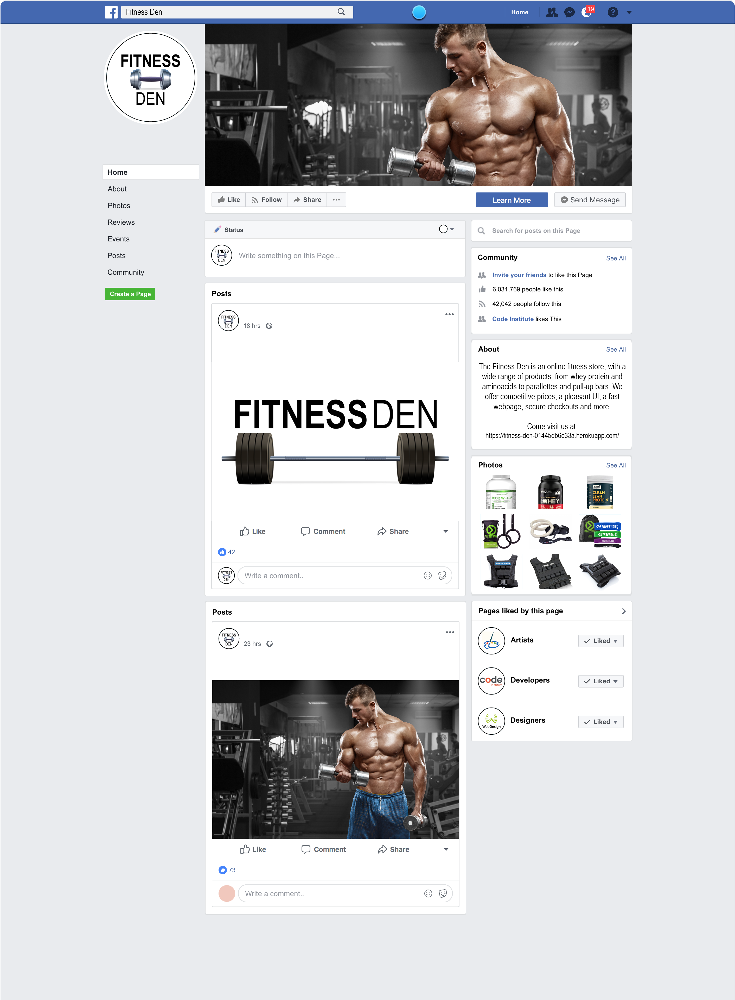

# The Fitness Den
Developed by **Dorian Wolarz**, a Code Institute Student

*The Fitness Den is a Full Stack fitness website. Users can create personal accounts and purchase fitness products.*

[LINK TO HEROKU VERSION](https://fitness-den-01445db6e33a.herokuapp.com/)

## Contents
1. [User Experience](#user-experience)
2. [Design](#Design)
3. [Data Models](#data-models)
4. [Features](#features)
5. [Technologies Used](#technologies-used)
6. [Testing and Validation](#testing-and-validation)
6. [Known Bugs](#known-bugs)
8. [Deployment](#deployment)
9. [Credits](#credits)

## User Experience

For the purpose of this project I have created a list of fitting user and admin stories to serve as a design guide in creating this webpage. *The Fitness Den* is a store selling fitness products and, as such, I based it on the Code Institute project of *Boutique Ado* given the similar theme. I've come up with the following user and admin stories thus far:

### Admin Stories

* As a **site admin** I can **add a product** so that **I can increase the stocks in my store**.
* As a **site admin** I can **edit and update existing products** so that **I can make real time changes to my stocks**.
* As a **site admin** I can **delete a product** so that **I can remove an existing item from the listings**.

### User Stories - Navigation

* As a **site user** I can **view a list of products** so that **I can purchase items**.
* As a **site user** I can **identify the price, description, product rating and other details** so that **I can purchase a product to my liking**.
* As a **site user** I can **identify deals, clearance items and special offers** so that **I can make the purchases I want**.
* As a **site user** I can **view the total purchases** so that **I can avoid spending funds beyond my budget**.
* As a **site user** I can **sort the list of available products** so that **I can identify best rated and best priced items**.
* As a **site user** I can **sort a specific category of product** so that **I can find the best deals in the category I'm interested in**.
* As a **site user** I can **sort multiple categories simultaneously** so that **I can find best offers across multiple categories**.
* As a **site user** I can **search for a product by name or description** so that **I can easily find what I'm looking for**.
* As a **site user** I can **access search bar results** so that **I can quickly decide whether the product I want to purchase is available**.

### User Stories - Accounts and Management

* As a **site user** I can **easily register a user account** so that **I can have access to my personal profile**.
* As a **site user** I can **log in and out** of my profile so that **I can access my personal account information**.
* As a **site user** I can **safely recover my password** in case **I forget it**.
* As a **site user** I can **receive a confirmation e-mail after registration** so that **I can approve my profile**.
* As a **site user** I can **have a personalized user profile** so that **I can view my order history, order confirmations, as well as save and edit my personal payment information**.

### User Stories - Purchases

* As a **site user** I can **easily select the quantity and size of product** so that **I can purchase an item I desire**.
* As a **site user** I can **views the items I currently have in my bag** so that **I can identify the total cost of my purchase as well as the items I will receive**.
* As a **site user** I can **adjust the quantity of items in my shopping bag** so that **I can make changes to my purchase before checkout**.
* As a **site user** I can **enter my payment information** so that **checkout quickly**.
* As a **site user** I can **be certain that my personal and payment information are safe** so that **I can confidently provide sensitive information to make a purchase**.
* As a **site user** I can **view an order after I checkout** so that **I can verify I haven't made any mistakes**.
* As a **site user** I can **receive an e-mail confirmation after I checkout** so that **I can be sure my payment went through and so I can keep a record**.

I followed the *Agile Methodology* when developing user stories and all of them are available on a separate Project board as well.

## Design

N/A - colours, fonts and wireframes

## Data Models

N/A - custom models

## Features

N/A - all the features of the webpage, explained

## Technologies Used

### Languages

* HTML 5
* CSS 3
* Python 3
* JavaScript

### Tools and Websites

* Git *for version control*
* GitHub *to store code and deploy the website*
* GitPod *as an IDE to build the project and edit the code*
* Django *as framework to develop the project*
* Heroku *to deploy the project and host it*
* Stripe *to generate necessary webhooks and make fictional payments*
* Bootstrap *to access HTML design templates*
* Crispy Forms *to access and display premade forms on the website*
* Fontawesome *to access free icons*
* GoogleFonts *to access different font styles*
* ElephantSQL *to serve as a database for Heroku*
* W3C *to validate HTML and CSS code*
* CI Python Linter *to validate Python code*
* JShint *to validate JavaScript code*

## Testing and Validation

N/A - all the testing and validation of code and functions of the website

## Known Bugs

N/A - bugs which are known and still unfixed

## Deployment

### GitHub

This project was deployed using *Code Institute's CI Full Template* on GitHub.

You can *deploy the repository* on GitHub by following these steps:

1. In your GitHub repository navigate to the *Settings* tab
2. In the menu on the left hand side select *Pages*
3. For the source of your repo select *branch: main*
4. After the webpage refreshes, you will see a ribbon on the top saying: *"Your site is published at https://ravopl.github.io/fitness-den/"*

You can *fork the repository* by following these steps:

1. Go to the GitHub repository
2. Click on Fork button in upper right hand corner

You can *clone the repository* by following these steps:

1. Go to the GitHub repository
2. Locate the Code button above the list of files and click on it
3. Select if you prefer to clone using HTTPS, SSH or GitHub CLI and click the copy button to copy the URL to your clipboard
4. Open GitBash
5. Change the current directory to the one you previously cloned
6. Type git clone and paste the URL from the clipboard ($ git clone https://github.com/YOUR-USERNAME/YOUR-REPOSITORY)
7. Press 'Enter' to create your local clone

### Django

This project uses *Django* with *Code Institute's CI Full Template* and requires a set of commands to work properly.

1. In your GitPod workspace type: `pip3 install django`
2. To make sure everything is working as intended run the following command: `python3 manage.py runserver`
3. Run the initial migration with the following command: `python3 manage.py migrate`
4. In order to access the admin panel you have to create a superuser by using the following command: `python3 manage.py createsuperuser` after which you fill out the necessary details.
5. Once everything is set up properly you can run the initial commit and push to GitHub.

### Heroku

This project was deployed on Heroku.

After the repository is forked, you can deploy it by following these steps:

1. Create an account on Heroku or log into your existing one
2. Go to the *Dashboard*
3. Create a new app, add its name and your geographical region
4. Click on *Create App*
5. Go to your *Settings* tab
6. Under *Config Vars* make sure you have set the following:
    * *USE_AWS* with its value of *True*
    * *AWS_ACCESS_KEY_ID* with its custom value
    * *AWS_SECRET_ACCESS_KEY* with its custom value
    * *DATABASE_URL* with its custom value
    * *SECRET_KEY* with its custom value
    * *STRIPE_PUBLIC_KEY* with its custom value
    * *STRIPE_SECRET_KEY* with its custom value
    * *STRIPE_WH_SECRET* with its custom value
    * *HEROKU_POSTGRESQL_CRIMSON_URL* with its custom value
7. Go to your *Resources* tab and make sure you have *Heroku Postgres* either as a hobby dev or the paid options.
8. In your GitPod install the database url with the following command: `pip3 install dj_database_url`
9. Then, once that is installed, proceed to install the psycopg binary with the following command: `pip3 install psycopg2-binary`
10. Make sure you install and load all app requirements in GitPod with the following command: `pip3 freeze > requirements.txt`
11. In *settings.py* import dj_database_url at the top of the file and parse the temporary database settings.
12. Run migrations and create superuser for Heroku.
13. Remove the temporary database you set up previously and create an if statement in *settings.py* to run the postgres on Heroku.
14. Install the package called gunicorn with the following command: `pip3 install gunicorn`
15. Alternatively, if the package doesn't load properly, you can install Heroku functionality directly with the following command: `npm install -g heroku`
16. Create a Procfile and input the following content: `web: gunicorn fitness_den.wsgi:application`
17. In the *Config Vars* in Heroku temporarily input *DISABLE_COLLECTSTATIC* with the value of 1 to stop Heroku from collecting static files during initial deployment.
18. Add Heroku to your *ALLOWED_HOSTS* section in *settings.py*. Make sure to enable localhost as well.
19. Deploy directly to Heroku with the following command: `git push heroku main`
20. If you want Heroku to keep automatically updating the project you can set *'enable automatic deploys'* under the *'deployment method'* option.

### Amazon AWS S3

1. Open your browser and navigate to Amazon AWS.
2. Log in to an existing account or create a new one.
3. Create a new S3 bucket as well as "media" and "static" directories within the bucket itself.
4. Copy the details of your newly made bucket from the dashboard. You will need the following:
    * Storage Bucket Name
    * Storage Bucket Region Name
    * Access Key ID
    * Secret Access Key
5. You must then add the following settings to the env.py file to link directly to AWS:
    * os.environ["AWS_ACCESS_KEY_ID"] = `'your access key'`
    * os.environ["AWS_SECRET_ACCESS_KEY"] = `'your secret access key'`
6. Once that's done, you can go back to Heroku and add the keys and values from AWS and env.py to the config vars

### Stripe

1. Open your browser and navigate to Stripe.com.
2. Create a Stripe account or log into an existing one.
3. Ensure you click *"Developer Account"* to gain access to the API keys required to run the payment processes.
4. Once you have successfully created your Stripe account make sure you do the following:
    * Copy the Stripe Public Key, Stripe Secret Key and Stripe Webhook Key into your env.py file and into the Heroku Config Vars section.
5. Then, configure the *settings.py* file with the following variables required by Stripe:
    * `STRIPE_PUBLISHABLE_KEY = os.environ.get('STRIPE_PUBLISHABLE_KEY')`
    * `STRIPE_SECRET_KEY = os.getenv('STRIPE_SECRET_KEY', '')`
    * `STRIPE_WH_SECRET = os.getenv('STRIPE_WH_SECRET', '')`

## Credits

### Code and Assets

* *Code Institute* for the CI Full Template on GitHub
* *Code Institute* for the deployment terminal on Heroku
* *Code Institute* for *Boutique Ado*

### Media

* [Main Page Photo by Invictus at Wallpaper Abyss](https://wall.alphacoders.com/big.php?i=1300550)
* [Creatine, Whey and New Arrivals Pictures](https://evergreen.ie/)
* [Aminoacid and Deals Pictures](https://www.hollandandbarrett.ie/)
* [Equipment and Clearance Pictures](https://www.streetgains.eu/)
* [Gym Equipment Vectors for FB Mock-Up by macrovector](https://www.freepik.com/free-vector/dumbbells-barbells-weight-fitness_3949273.htm#query=dumbbell&position=5&from_view=keyword&track=sph#position=5&query=dumbbell)
* [Artist Vector for FB Mock-Up by pollarize](https://www.freepik.com/premium-vector/brush-palette-icon-watercolor-logo-design_18538075.htm#query=artist%20logo&position=34&from_view=keyword&track=ais)
* [Web Design Vector for FB Mock-Up by ferart88](https://stock.adobe.com/ie/search?k=%22web+design+logo%22&asset_id=85732813)